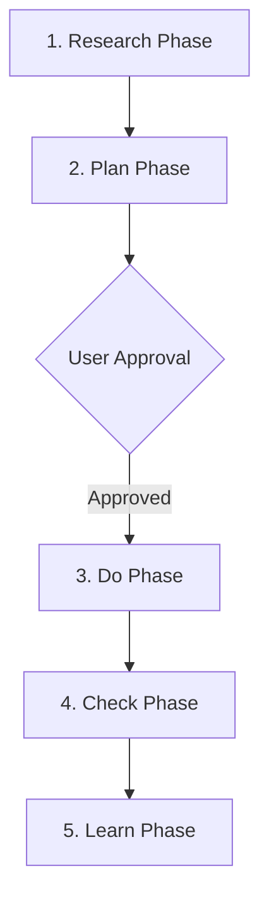

# ChaosEngine Project Playbook (Gemini Edition)

This playbook outlines the exact step-by-step workflow and prompt templates to use when working with AI coding agents under ChaosEngine inside this project, optimized for the **Gemini** developer client.

---

## ⚡ Gemini Integration & Hooks
ChaosEngine is configured to monitor Gemini's lifecycle. When running tasks:
* **Ambient Instructions:** Gemini reads its startup rules from [GEMINI.md](file:///Users/youssf/chaos-engine-demo/GEMINI.md).
* **BeforeTool hook:** Gemini automatically executes the `PreToolUse` hook before running any code execution tools to verify safety constraints.

---

## 📋 The 5-Step Delivery Loop

### Phase 1: Research (Triage & Context Retrieval)
* **Goal:** Size the blast radius, evaluate reversibility, and fill out the research receipt.
* **AI Prompt to use:**
  > "Before making any changes to the codebase, load `.chaos-engine/skills/chaos-engine/SKILL.md`. Inspect current project files, run local database queries using `.chaos-engine/tool.py memory query`, and fill out a research receipt. Specify the blast radius (one file, one module, or public contract with many callers) and the reversibility of the changes."

---

### Phase 2: Plan (Verification Scope & Review Consent)
* **Goal:** Define proposed changes and agree on verification tests and adversarial reviews.
* **AI Prompt to use:**
  > "Create an implementation plan detailing the Goal Description, Proposed Changes (demarcating modified, new, and deleted files), and a Verification Plan. Suggest a validation scope (edited tests, edited + directly impacted tests, or full suite) and ask me whether to enable terminal adversarial review (capped at 2 rounds). Stop and wait for my explicit approval before writing any code."

---

### Phase 3: Do (Coherent Implementation)
* **Goal:** Write all code and tests in a single, uninterrupted batch.
* **AI Prompt to use:**
  > "Implement the approved changes. Focus on the root cause of invariants rather than treating symptoms. Make all edits in a single coherent batch. Do not run intermediate tests or commit actions during this phase."

---

### Phase 4: Check (Consolidated Validation)
* **Goal:** Execute the chosen test suites and run adversarial code review.
* **AI Prompt to use:**
  > "Implementation is complete. Execute the approved validation tests using `.chaos-engine/tool.py`. If terminal adversarial review was enabled, invoke a reviewer subagent to check the diff against the specification and provide actionable feedback."

---

### Phase 5: Learn (Durable Learning)
* **Goal:** Capture lessons learned and update local memory.
* **AI Prompt to use:**
  > "Run the learned-lessons workflow. Identify any failures, bugs, or new rules discovered during this session. Save these lessons to the local database using the `memory save` command via `.chaos-engine/tool.py` to update the product map."
