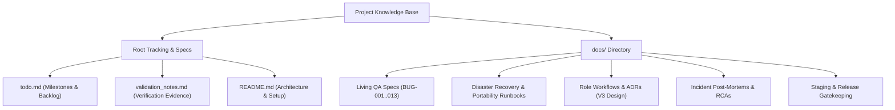

# Project Documentation & Development Log Utility Guide

> [!NOTE]
> This guide outlines the organizational structure, strategic value, and practical engineering use cases for all timeline, progress, and architectural documentation in the repository.

---

## 1. Overview & Knowledge Base Architecture

The project maintains an auditable development timeline and architectural history across root tracking files and specialized records in the [`docs/`](file:///data/data/com.termux/files/home/mizan-al-jawda-crowd-testing/docs) directory:

---

## 2. Core Functional Pillars & How to Benefit

### A. Living Quality Assurance (QA) Specifications
* **Key References:**
  - [`docs/referenced-bug-triage-2026-08-23.md`](file:///data/data/com.termux/files/home/mizan-al-jawda-crowd-testing/docs/referenced-bug-triage-2026-08-23.md)
  - [`docs/referenced-main-qa-findings-2026-08-26.md`](file:///data/data/com.termux/files/home/mizan-al-jawda-crowd-testing/docs/referenced-main-qa-findings-2026-08-26.md)
  - [`docs/referenced-followup-review-2026-08-23.md`](file:///data/data/com.termux/files/home/mizan-al-jawda-crowd-testing/docs/referenced-followup-review-2026-08-23.md)
* **Practical Benefit & Usage:**
  - **Defect Traceability:** Every documented bug (`BUG-001` through `BUG-013`, covering mobile 375px RTL overflow, anonymous workspace guardrails, zero-balance payouts, and unhandled tRPC table read errors) maps directly to automated unit/integration tests in `*.test.ts`.
  - **Regression Prevention:** When modifying workspace routing or triage states, running `npx vitest run` guarantees that resolved edge cases remain covered.

---

### B. Disaster Recovery & Zero-Lockin Portability Runbooks
* **Key References:**
  - [`docs/portable-runtime-configuration.md`](file:///data/data/com.termux/files/home/mizan-al-jawda-crowd-testing/docs/portable-runtime-configuration.md)
  - [`docs/environment-template.md`](file:///data/data/com.termux/files/home/mizan-al-jawda-crowd-testing/docs/environment-template.md)
  - [`docs/supabase-access-audit.md`](file:///data/data/com.termux/files/home/mizan-al-jawda-crowd-testing/docs/supabase-access-audit.md)
  - [`docs/supabase-connection-notes.md`](file:///data/data/com.termux/files/home/mizan-al-jawda-crowd-testing/docs/supabase-connection-notes.md)
* **Practical Benefit & Usage:**
  - **Rapid Infrastructure Spin-up:** Allows provisioning a brand-new staging or disaster recovery environment (Supabase + Vercel or Render) in minutes without reverse-engineering connection pooler ports (`6543` transaction pooler vs `5432` session pooler) or environment contracts.
  - **Secret Sanitization:** Enforces standard non-secret environment templates so production secrets, service role keys, and database passwords are never exposed or committed.

---

### C. Developer & AI Coding Agent Onboarding
* **Key References:**
  - [`docs/v3-workflow-design-2026-08-24.md`](file:///data/data/com.termux/files/home/mizan-al-jawda-crowd-testing/docs/v3-workflow-design-2026-08-24.md)
  - [`docs/ui-reference-notes-2026-08-24.md`](file:///data/data/com.termux/files/home/mizan-al-jawda-crowd-testing/docs/ui-reference-notes-2026-08-24.md)
* **Practical Benefit & Usage:**
  - **Multi-Tenant Role Architecture:** Clearly defines permissions and domain models for all 4 user roles:
    1. **Tester:** Applied cycles, reports, wallet ledger.
    2. **Business Owner:** Projects, cycles, severity bounty rates, report acceptance.
    3. **TTL (Test Team Lead):** Scoped cycle triage, requests for information.
    4. **Community Manager:** Assigns TTLs, approves payout disbursements.
  - **RTL Typography & UI Rules:** Preserves Arabic diacritic spacing, Cairo font hierarchy, and RTL layout boundaries for new UI components.

---

### D. Incident Post-Mortems & Operational Learnings
* **Key References:**
  - [`docs/production-signin-incident-2026-08-23.md`](file:///data/data/com.termux/files/home/mizan-al-jawda-crowd-testing/docs/production-signin-incident-2026-08-23.md)
  - [`docs/legacy-branch-audit-2026-08-24.md`](file:///data/data/com.termux/files/home/mizan-al-jawda-crowd-testing/docs/legacy-branch-audit-2026-08-24.md)
  - [`docs/manus-independence-audit-2026-08-24.md`](file:///data/data/com.termux/files/home/mizan-al-jawda-crowd-testing/docs/manus-independence-audit-2026-08-24.md)
* **Practical Benefit & Usage:**
  - **Root Cause Analysis (RCA):** Documents exact failure modes (e.g., serverless Vercel function routing precedence, SPA catch-all collisions with `/api/*`, and credential rotation procedures) to prevent past issues from recurring.
  - **Zero Vendor Lock-in Audit:** Confirms complete independence from proprietary hosting dependencies, ensuring the app runs cleanly in local Node/Termux, Docker, Render, or Vercel.

---

### E. Staging-to-Production Release Gatekeeping
* **Key References:**
  - [`docs/staging-environment-plan.md`](file:///data/data/com.termux/files/home/mizan-al-jawda-crowd-testing/docs/staging-environment-plan.md)
  - [`docs/vercel-production-branch-transition-2026-08-23.md`](file:///data/data/com.termux/files/home/mizan-al-jawda-crowd-testing/docs/vercel-production-branch-transition-2026-08-23.md)
  - [`docs/vercel-deployment-log.md`](file:///data/data/com.termux/files/home/mizan-al-jawda-crowd-testing/docs/vercel-deployment-log.md)
* **Practical Benefit & Usage:**
  - **Promotion Flow:** Defines safe promotion protocols: feature branch $\rightarrow$ `staging` branch (with isolated Supabase preview environment) $\rightarrow$ pull request verification $\rightarrow$ `main` (Production).
  - **Audit Trail:** Links git commit hashes directly to Vercel deployment events for reproducible builds.

---

### F. Continuous Progress Tracking & Verification History
* **Key References:**
  - [`todo.md`](file:///data/data/com.termux/files/home/mizan-al-jawda-crowd-testing/todo.md)
  - [`validation_notes.md`](file:///data/data/com.termux/files/home/mizan-al-jawda-crowd-testing/validation_notes.md)
* **Practical Benefit & Usage:**
  - **Milestone Clarity:** Tracks execution state across 160+ checklist items, maintaining explicit status for open tasks (such as Resend email domain verification and staging branch fast-forwarding).
  - **Verification Evidence:** Logs timestamps, test outputs, and validation steps for all delivered enhancements.

---

## 3. Best Practices for Maintaining Documentation

1. **Update `todo.md` and `validation_notes.md` with Every Major Feature:** Whenever completing architectural improvements (e.g. the Tester Dashboard Performance Optimization), log the changes and test outcomes.
2. **Commit Test Cases with Bug Reports:** Any new defect recorded in `docs/` should be paired with a corresponding Vitest spec in `*.test.ts`.
3. **Never Log Sensitive Secrets:** Always adhere to the non-secret logging policy established in the security audit documents.
